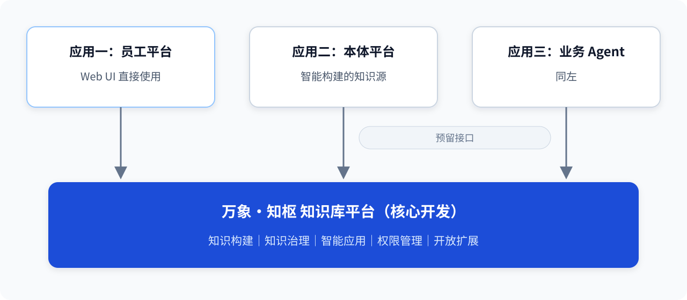

# 万象·知枢 企业级智能知识库平台 总体方案

> 版本：v0.2
> 日期：2026-09-04
> 作者：dlh
> 状态：待 mentor 评审
>
> 配套文档：[02-WeKnora平台PRD](./02-WeKnora平台PRD.md) ｜ [03-WeKnora技术方案](./03-WeKnora技术方案.md)

---

## 1. 背景与定位

公司积累了大量军事领域文档资料，目前缺少统一的知识管理载体。这些资料包括条令条例、作战纲要、野战手册、专业书籍、教材、研究报告等，不同资料的编排结构差异较大。本项目建设一个**企业级智能知识库平台**，以开源项目 [WeKnora](https://github.com/Tencent/WeKnora)（腾讯开源，v0.7.2，MIT 许可）为基础进行二次开发，实现知识的入库、检索、问答、沉淀，并向公司其他系统提供知识服务能力，可进一步服务客户需求。

平台承载三类内容资产：

| 资产类型 | 说明 | 本期范围 |
|---|---|---|
| 军事领域文档资料 | 条令、条例、作战纲要、野战手册、专业书籍、教材、研究报告等，文本型与扫描件并存 | **一期核心** |
| 衍生知识产物 | 综述报告、思维导图、FAQ 等由平台生成的沉淀物 | **一期核心** |
| 对抗类时序数据 | 演习/推演类结构化时序数据 | **暂缓**（见 §7.4） |

对抗类时序数据与文档型知识库的数据形态、检索方式差异较大（WeKnora 为文档型 RAG 系统，无时序语义），且目前尚未拿到具体数据样本，暂不做设计。

文档解析与引用遵循**原文结构优先**原则：保留原文已有的篇、章、节、标题和页码等结构；原文没有“条”级编号时，不强行生成条款结构，问答引用定位到对应章节、小节、段落或原文片段。

## 2. 三种应用形式

平台最终服务三类调用方。**MVP 阶段只考虑应用一**，应用二、三预留接口。



### 2.1 应用一：员工通用知识平台（MVP 交付形态）

面向公司内部员工的 Web 平台，支持个人使用与多人协作：

- **快速学习 / 查阅**：围绕军事领域文档资料进行有据可查的问答，引用可回溯至原文章节、小节、段落或具体片段；
- **知识沉淀**：员工个人文档可入库管理，优质内容可沉淀为部门级/公开级知识；
- **权威来源**：问答必须带引用出处，杜绝无依据生成。

具体功能（智能问答、文档研读、自动综述、思维导图、扫描件支持）见 PRD §3。

### 2.2 应用二：本体平台辅助

公司另一团队在研的"本体平台"业务尚未搭建完成，无法联调。目前考虑以 **API** 对接：本体平台通过 HTTP 请求提出问题 → 传到知识库平台 → 知识库完成检索与生成 → 返回 JSON 格式的答案和引用来源。

WeKnora 自带的开放 API（REST + API Key 能力级授权）即接口层，应用二的对接能力是现成的，不需要额外开发。

### 2.3 应用三：其他业务 Agent 辅助

尚在方案阶段。与应用二同等处理，另可选 **MCP 协议**接入（WeKnora 自带 MCP Server，29 个工具，支持 stdio/SSE/HTTP 三种传输），业务 Agent 框架若原生支持 MCP 可直接挂载，无需自研适配层。

### 2.4 统一 Gateway 的定位

三类应用形式未来可能经一个统一 gateway 路由分发。MVP 不建设 gateway：

1. MVP 阶段应用一的 Web UI 直连平台即可；
2. 统一认证、审计、限流等职责不属于本期范围；
3. WeKnora 自身 API 层已具备认证（JWT/API Key/OIDC）与审计日志能力。

Gateway 为后续演进路线（§7.1）。

## 3. 数据与权限分层

### 3.1 分层模型

按目前确认的权限需求，知识资产分三层：

| 层 | 谁可见 | 内容举例 |
|---|---|---|
| **公开层** | 全公司员工 | 公开军事手册、条令、专业书籍与教材 |
| **部门层** | 本部门成员（部门可能多级） | 部门内部资料、专业教材 |
| **个人层** | 本人 | 个人笔记、个人文档 |

### 3.2 落地方式：部门 = 租户（MVP 方案）

WeKnora 的原生隔离单位是**租户（Tenant，即"空间"）**，权限机制为空间内 RBAC（viewer / contributor / admin / owner 四级）+ 资源创建者归属 + 跨租户共享空间。映射方案：

```
公开层：建一个覆盖全公司的 Organization，公共知识库共享给该组织
        → 所有部门空间内的成员可见
部门层：每个部门一个空间（租户），部门知识库建在本部门空间内
        → 部门成员加入本部门空间，按 RBAC 角色享有权限
个人层：员工个人空间（默认空间）内自建知识库
        → 仅本人可见，可主动提升为部门级/公开级
```

MVP 阶段多级部门当作一级（部门 → 员工两层），部门树结构作为后续演进。这一方案的全部实现是"配置 + 管理流程"，不改 WeKnora 源码，代价最小、可随时调整。

## 4. 模型与算力约束

平台部署于私有云，所有模型以 URL + Key 访问，**仅可使用开源模型**。已确认可用：

| 用途 | 模型 | 说明 |
|---|---|---|
| 对话基座 | `qwen3.8-27b` | 问答等高频功能默认模型 |
| 对话备选 | `deepseek-v4-flash-0731` 等参数更大的模型 | 速度/成本备选 |
| 高阶任务备选 | `deepseek-v4-pro` 等旗舰模型 | 综述/写作类任务质量不足时升级 |
| Embedding | `qwen3.7-text-embedding` | 向量化 |
| Rerank | `qwen3-rerank` | 重排 |
| OCR/VLM | `DeepSeek-OCR`、`qwen-vl-ocr-latest`、`qwen3-vl-plus` 等 | 扫描件解析（见技术方案 §6） |
| 翻译（二期） | `qwen-mt-plus / flash / turbo` | 翻译专用系列 |

模型经 URL+Key 访问，与公有云 API 在集成方式上无本质区别，能力上限受所选开源模型限制，质量风险高的功能要求先做模型能力验证（POC）。

## 5. 功能分期总览

| 期 | 功能 | 交付深度 |
|---|---|---|
| **一期（MVP）** | 智能问答（含教学模式增强）· 文档研读 · 自动综述 · 思维导图 · 扫描件支持 | 本周出 PRD + 技术方案，随后开发 |
| **二期** | 文档多语种翻译 · 辅助写作 · 后训练语料生成 | 本期文档仅做介绍（PRD §4） |
| **三期** | 智慧研讨（异步讨论区）· 学习路径（含学科资源智能推送）· 语料审核 | 本期文档仅做介绍（PRD §5） |

一期聚焦"文档理解"共享底座（问答、研读、综述、导图同源），翻译/写作技术路径独立放二期，研讨/学习路径依赖前两期行为数据放三期。

## 6. 工程基线

- **基座**：fork 仓库 `DerrickLinus/military-knowledge-platform`，上游为官方 WeKnora（main 分支保持同步）；
- **二开原则**：**跟住上游**——所有扩展走 WeKnora 官方扩展点（Agent 工具注册、内置 Agent/提示词 YAML、RAG 流水线插件、数据库迁移规范），不改动其权限内核，保证可持续合并上游修复与新功能；
- **部署形态**：MVP 为单机 docker-compose（6 个核心容器：frontend / app / docreader / postgres(ParadeDB，自带 BM25+pgvector，无需独立向量库) / redis / sandbox），认证用 WeKnora 本地账号（JWT）；
- **扩展点参考**：`website-docs/06-development/03-extension-points.md`（官方 9 大扩展点文档）。

## 7. 演进路线

### 7.1 统一 Gateway
当应用二或应用三出现首个真实调用方时开发。仅认证、路由、审计，业务逻辑一律不进 gateway。

### 7.2 OIDC 单点登录
当公司要求接入统一账号体系时启用。WeKnora 已内置 OIDC 支持（已有测试配置，可本地验证 IDC 流程），属配置级工作。

### 7.3 文档级权限 / 多级部门树
届时将 Organization 改造为部门树或将 RBAC 挂接部门，属于对权限内核的改动。

### 7.4 对抗类时序数据
拿到具体数据样本后立项。初步方向：原始时序数据独立建时序存储与分析服务，**不进 WeKnora 文档管线**；其衍生的分析报告、复盘文档作为普通文档入库。
