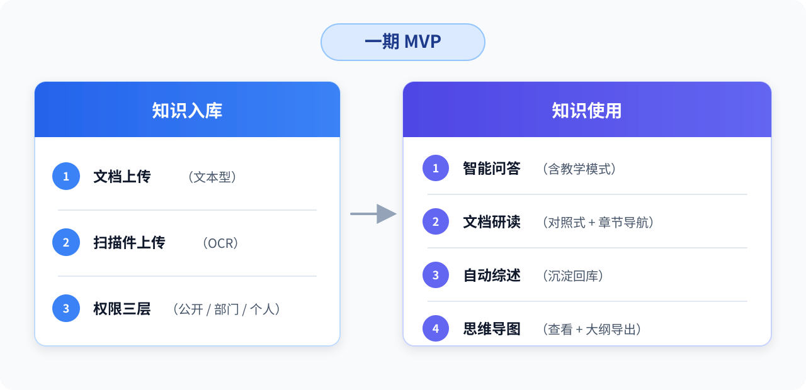
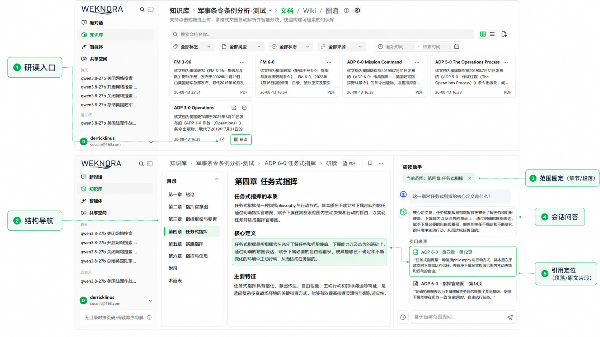
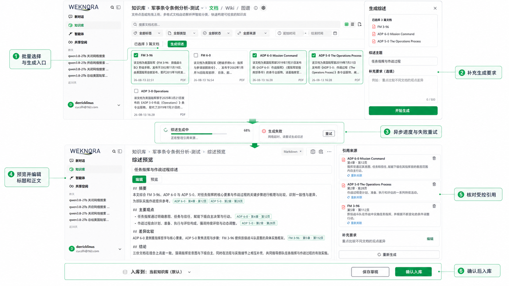
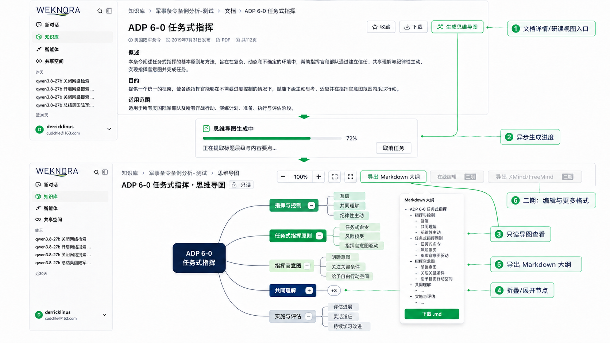

# WeKnora 知识库平台 PRD（一期 MVP）

> 版本：v0.2
> 日期：2026-09-04
> 作者：dlh
> 状态：待 mentor 评审
>
> 上游文档：[01-总体方案](./01-总体方案.md)（应用形式、权限分层、演进路线在此定义，本文不重复）｜技术实现见 [03-WeKnora技术方案](./03-WeKnora技术方案.md)

---

## 1. 定位与用户

**一句话定位**：公司军事领域文档资料与专业知识的权威问答和沉淀平台——每次回答可溯源，每份沉淀可复用。

一期目标用户（单机部署，暂无并发压力指标，按部门级试用规模设计）：

| 角色 | 典型诉求 |
|---|---|
| 普通员工（查询者） | “这份材料如何阐述该问题？”——快速查到相关原文和解释 |
| 学习者（新员工/轮岗） | 系统性学习某份军事手册、条令或专业书籍，边读边问，检验掌握程度 |
| 知识贡献者（业务骨干） | 把个人积累的文档、综述沉淀为部门/公开知识 |

> "辅助学习"一期不设独立功能：目前未收到明确的独立需求，按评审共识拆解为智能问答的**教学模式增强**（见 §3.1）。系统化的学习路径生成放三期（§5.2）。

## 2. 新增功能（一期）

各功能的"已有底座/需新建"拆解见技术方案；本文只定义功能介绍、交互方式与验收标准。

---

## 3. 一期功能详述

### 3.1 智能问答（含教学模式增强）

**功能介绍**

1. 作为员工，在问答框询问某份军事材料如何阐述一个概念或问题，系统给出回答并附原文引用；点击引用可看到对应章节、小节、页码或内容片段，答案有据可查。
2. 作为新员工，切换到“学习模式”提问同一问题，除答案外还得到：涉及概念的通俗解释、相关原文依据、关联知识，以及一个检验我是否理解的追问，帮助新员工从“查到”到“学会”。
3. 作为员工，提问如果涉及多个知识库，可以 @指定知识库或 @指定文档来圈定回答范围。

**交互定义**

- 问答入口沿用 WeKnora 现有会话界面（多轮会话、流式输出、历史会话管理均为现成能力）；
- 每个回答必须携带引用列表；引用点击可定位到来源文档的具体分块（现有能力）；
- **教学模式**：会话内可切换的问答预设（教学 Agent）。模式差异仅在回答风格与结构：概念解释 → 原文依据 → 关联知识 → 检验性追问。不新增页面，不新增数据结构；
- 支持 @知识库 / @文档 圈定检索范围（现有能力）。

**验收标准**

- [ ] 对已入库的条令、手册、书籍等不同结构文档提出典型问题，回答均附引用且引用可回溯到对应原文分块；
- [ ] 教学模式下，回答包含原文依据、概念解释与一个检验性追问，三要素齐全；
- [ ] @指定文档后，回答仅引用该文档内容；
- [ ] 模型能力验证（POC）：用基座模型 `qwen3.8-27b` 跑 30 个典型军事文档问答用例；用例覆盖条令、作战纲要、野战手册和书籍/教材等结构，引用准确率达标后方可进入开发。

> 模型依赖等级：高（依赖强推理）。

### 3.2 文档研读

**功能介绍**

1. 作为学习者，我打开某个文档的研读视图，左侧按原文实际目录/标题层级展示内容，右侧是对话区；我点选“第四章”后提问，回答只围绕该章内容，引用精确定位到相关段落或原文片段，并在原文件页码可靠时同时显示页码。
2. 作为学习者，我读到某段不解的表述，选中完整段落后提问，回答围绕所选内容展开；引用回到该段或支撑回答的其他原文片段（一期支持章节级持续圈定与整段级提问，划词级弹卡解释放二期）。

**交互定义**

- 入口：知识库文档列表 → "研读"按钮进入研读视图；
- 研读视图 = 左侧文档阅读区（按文档目录/标题层级渲染，沿用文档分块的标题结构）+ 右侧会话区（复用问答会话能力）；
- 范围圈定：点击章节后，将其设为该会话的持续检索范围；选中完整段落后，本次提问以该段为核心范围，所属章节可作为补充上下文。会话区始终显示当前范围，用户可清除或切换；
- 引用定位：右侧回答的引用，点击后左侧阅读区滚动定位到对应分块并高亮；
- 章节导航：左侧目录树可折叠展开，点击跳转。

**验收标准**

- [ ] 进入任一已入库文档的研读视图，左侧按原文已有标题层级正确渲染目录和正文；无可靠标题层级时可降级为页码/分块顺序浏览；
- [ ] 圈定章节后提问，回答引用不超出所选章节；
- [ ] 选中完整段落后提问，本轮回答以该段为核心，并能明确展示当前圈定范围；
- [ ] 引用点击能定位到左侧对应段落/原文片段并高亮；
- [ ] 扫描件（经 OCR 入库）同样可进入研读视图，目录/标题层级或页码/分块顺序的还原质量满足 §3.5 中的规定。

> 模型依赖等级：中（能力主要在检索与结构渲染，一期形态不依赖强推理）。

### 3.3 自动综述

**功能介绍**

1. 用户多选 5 篇同主题军事文档（如相关条令、作战纲要、野战手册与研究资料），点击“生成综述”，系统生成一份带引用的综述报告，可以把它作为一篇新文档沉淀回知识库，供全部门检索引用。
2. 之后可以直接询问**某一作战主题在不同资料中的观点与差异**，系统检索到这份综述并基于它回答。

**交互定义**

- 入口：知识库文档列表多选 → "生成综述"；
- 生成过程异步（任务进度可见），产物为带引用的 Markdown 综述报告；
- 产物**默认沉淀回所选知识库**（作为一篇新文档，走正常入库管线，可被后续检索与引用）；
- 生成参数（一期从简）：综述主题/角度由所选文档自动归纳，用户可输入一段补充要求；
- 失败处理：任务失败可重试；产物入库前用户可预览、编辑标题和正文，也可补充要求后重新生成，确认最终版本后入库。

**验收标准**

- [ ] 多选 N 篇（N≥2）文档可生成综述，产物含来源引用；
- [ ] 综述入库后可被检索命中，并作为后续问答的引用来源；
- [ ] 综述内容不出现所选文档范围之外的编造引用（引用可逐条回溯）。

> 模型依赖等级：**高**（多文档合成质量直接受模型上限约束）。

### 3.4 思维导图生成

**功能介绍**

1. 用户对某份材料点击“生成思维导图”，得到一张按原文章节/主题层级组织的导图，帮助快速建立整体框架认知；
2. 可以将思维导图导出为 Markdown 大纲。

**交互定义**

- 入口：文档详情/研读视图 → "生成思维导图"；
- 产物：基于文档标题层级与内容要点生成的 Mermaid 思维导图（平台前端已具备 Mermaid 渲染能力），异步生成、生成后即可查看；
- 一期产物**只读**：可查看、可折叠展开节点、可导出 Markdown 大纲文本；
- 二期：导图在线编辑、xmind/freemind 格式导出。

**验收标准**

- [ ] 任一已入库文档（含扫描件）可一键生成思维导图并正常渲染；
- [ ] 导图层级与文档已有章节/标题结构或内容主题结构基本一致（以人工抽查 10 篇为准）；
- [ ] 可导出 Markdown 大纲，粘贴到外部工具后层级结构保留。

> 模型依赖等级：中（结构化输出任务，现有模型可胜任；异常时退化为"纯标题层级导图"，仍有可用性）。

### 3.5 扫描件支持（OCR 入库）

**功能介绍**

用户上传扫描版 PDF 军事资料，系统自动完成 OCR 识别、结构化分块并入库，之后这份扫描件与文本型文档一样可检索、可问答、可研读、可生成导图。

**交互定义**

- 上传入口与文本型文档完全一致（同一上传流程，系统按文件自动路由解析引擎）；
- OCR 为异步过程，文档列表展示解析进度与状态；解析完成后无需人工干预即可使用全部功能；
- 解析质量异常（OCR 置信度低/乱码比例高）时文档标记异常状态，允许重新解析或更换引擎重试。

**验收标准**

- [ ] 扫描版 PDF 上传后自动路由到 OCR 引擎，全程无需人工操作；
- [ ] OCR 完成后：全文检索可命中扫描件内容；问答可引用扫描件；研读视图能还原标题层级，或在原文无可靠标题层级时按页码/分块顺序浏览（抽样 5 份典型扫描件，标题层级与阅读顺序识别准确率 ≥80%）；
- [ ] 解析失败的扫描件有明确异常状态与重试入口，不阻塞其他文档入库。

> 模型依赖等级：**高**（OCR 质量决定下游所有功能可用性）。可用引擎/模型见附录 A 与技术方案 §6。

---

## 4. 二期功能（仅做介绍）

| 功能 | 方向 | 底座现状 |
|---|---|---|
| **文档翻译** | 面向文档级翻译（整篇/选中章节），优先采用翻译专用模型（`qwen-mt-plus/flash/turbo`），保留原文对照；术语表（军事术语统一译名）为设计重点 | 无独立翻译功能，需新建 |
| **辅助写作** | 面向公文/教材写作的协作式辅助：大纲生成、续写、改写、润色，结合知识库引用保证内容合规 | 已有 `doc-coauthoring` 技能（引导式协作写作）可扩展 |
| **后训练语料生成** | 从库内文档批量生成指令对语料（JSON 键值对格式，兼容各家训练框架）：选库 → 批量生成 → 导出 JSONL。**"会话转语料"（真实问答沉淀为语料，数据飞轮入口）在二期完成设计**。人工审核 UI 放三期 | 无语料导出功能，需新建管线 |

## 5. 三期功能（仅做介绍）

| 功能 | 方向 |
|---|---|
| **智慧研讨（异步讨论区）** | 基于文档/主题的异步讨论：帖子-回复结构，**AI 被动响应**（被 @或被提问时参与答疑、总结），不主动发起话题。形态细节三期定 |
| **学习路径 / 学习建议（含学科资源智能推送）** | 基于学习者的问答/研读行为与知识体系，生成个性化学习路径与建议，并按学科/专业维度智能推送学习资源（依赖行为数据积累与学科标签体系；可参考内置 `openmaic-classroom` 课程生成能力） |
| **语料审核 UI** | 语料生成管线的人工审核界面：通过/驳回/修改，审核通过方可进入数据集 |

---

## 6. 非功能需求

| 维度 | 一期口径 |
|---|---|
| 部署 | 单机 docker-compose，私有云；预期并发/用户量级未定，按单机够用实现 |
| 认证 | WeKnora 本地账号（JWT）；OIDC 为演进项（总体方案 §7.2） |
| 权限 | 公开/部门/个人三层（总体方案 §3），部门=租户配置方案 |
| 审计 | 使用 WeKnora 自带租户级审计与知识库活动审计，不额外开发 |
| 数据安全 | 采用私有云部署的模型；文档不出私有云（云端 OCR 引擎若需出网访问，须进一步确认） |
| 可观测 | 使用 WeKnora 自带 Langfuse 链路追踪（可选启用），记录一次 AI 问答从输入到输出的完整调用链路 |

---

## 附录 A：可用模型（需要确认）

**对话/生成（chat）**

| 模型 | 定位 |
|---|---|
| `qwen3.8-27b` | **默认基座**：问答等高频功能 |
| `deepseek-v4-flash-0731` | 速度/成本备选 |
| `deepseek-v4-pro-0813`、`glm-5.3`、`kimi-k3`、`MiniMax-M3` | 质量升级备选 |

**Embedding**：`qwen3.7-text-embedding`（目前使用）、`Qwen3-Embedding-8B`、`bge-m3`、`jina-embeddings-v3/v4`

**Rerank**：`qwen3-rerank`、`jina-reranker-v3.5`、`bge-reranker-v2-m3-free`

**OCR / VLM（扫描件与图表理解）**：`DeepSeek-OCR`、`qwen-vl-ocr-latest`、`qwen3-vl-plus`、`qwen3-vl-8b-instruct`、`glm-4.6v`

**翻译（二期）**：`qwen-mt-plus`、`qwen-mt-flash`、`qwen-mt-turbo`